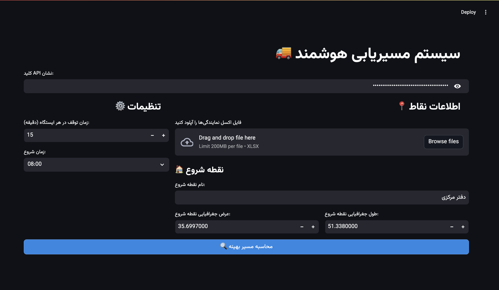

# Nova - Intelligent Route Optimization System

[](https://www.python.org/ "Python")
[](https://opensource.org/licenses/MIT)
[](https://streamlit.io/)

**Nova empowers you with intelligent transportation route optimization. This Streamlit application leverages the Neshan API and OR-Tools to deliver efficient route planning, interactive maps, and detailed travel schedules within a user-friendly web interface.**

## Overview

Nova is a robust Streamlit web application designed to revolutionize route optimization for transportation and logistics. By seamlessly integrating the Neshan API for real-world, Iran-specific route data and Google's powerful OR-Tools for advanced optimization algorithms, Nova generates demonstrably optimal routes that minimize both travel time and distance. Whether orchestrating complex delivery routes, managing field service appointments, or planning any multi-destination journey, Nova provides the essential tools to dramatically enhance operational efficiency and reduce transportation costs.

## Features

*   **Advanced Route Optimization:** Employs Google OR-Tools' cutting-edge optimization engine to calculate the most efficient route sequence for visiting multiple locations, rigorously minimizing total travel time and overall distance.
*   **Seamless Neshan API Integration:**  Harnesses the Neshan API to access highly accurate and current routing intelligence within Iran, incorporating real-time road network data for precise route calculations.
*   **Interactive & Visual Route Mapping:** Presents the optimized route on a dynamic Folium map, enabling users to intuitively visualize the entire journey and readily grasp the geographical context of their planned routes.
*   **Comprehensive Travel Schedule Generation:** Automatically creates a detailed, exportable schedule outlining the complete route, including precise arrival times, planned departure times, configurable stop durations, and calculated travel times between each location.
*   **Streamlined Excel Location Input:**  Offers effortless bulk location input via Excel file upload, accepting files containing location names, latitudes, and longitudes, dramatically simplifying the process of defining numerous destinations. **A sample Excel file (`sample_locations.xlsx`) is provided within the repository for immediate testing and format reference.**
*   **Flexible Manual Start Point Definition:**  Provides the option to manually specify a custom starting point by simply entering its name and precise geographic coordinates, offering adaptable route planning initiation.
*   **Configurable Stop Duration Management:**  Allows users to precisely define the duration of stops at each location, ensuring realistic and practically applicable route planning that accounts for on-site activities.
*   **Clear & Actionable Performance Metrics:**  Presents key performance indicators (KPIs) such as total route duration, total distance, and the total number of stops in an immediately understandable, visually clear format, enabling quick performance assessment.
*   **Intuitive Streamlit User Interface:**  Delivers a clean, highly intuitive, and fully responsive web-based interface, ensuring a seamless and efficient user experience across devices.

## Technologies Used

Nova is engineered using a powerful combination of leading-edge technologies and proven Python libraries:

*   **Streamlit:**  The foundational framework for building the interactive web application, providing a rapid and efficient methodology for developing and deploying data-centric web applications. ([https://streamlit.io/](https://streamlit.io/))
*   **Neshan API:** A specialized and robust Persian mapping and location services API, utilized to retrieve real-time, geographically relevant route intelligence, distances, and travel durations specifically within Iran. ([https://developer.neshan.org/](https://developer.neshan.org/))
*   **OR-Tools (Google Optimization Tools):**  A premier suite of optimization solvers from Google, employed to compute the mathematically optimal route sequence, minimizing total travel time based on provided location data and dynamically generated time matrices. ([https://developers.google.com/optimization](https://developers.google.com/optimization))
*   **Folium:** A versatile Python library for generating interactive, leaflet.js-powered maps.  Folium is instrumental in visualizing the optimized route on a rich geographical map, enhancing user understanding and route comprehension. ([https://python-visualization.github.io/folium/](https://python-visualization.github.io/folium/))
*   **streamlit-folium:** A specialized Streamlit component enabling the seamless embedding of Folium maps directly within Streamlit applications, facilitating interactive map displays within the web-based user interface. ([https://pypi.org/project/streamlit-folium/](https://pypi.org/project/streamlit-folium/))
*   **Pandas:** A high-performance data analysis and manipulation library, expertly used for efficiently processing location data from uploaded Excel files and constructing DataFrames for structured data tables and matrices. ([https://pandas.pydata.org/](https://pandas.pydata.org/))
*   **Requests:** A streamlined Python library for making human-friendly HTTP requests. `Requests` is used to interact seamlessly with the Neshan API, programmatically retrieving essential route data. ([https://requests.readthedocs.io/en/latest/](https://requests.readthedocs.io/en/latest/))
*   **NumPy:**  The fundamental package for numerical computation in Python. NumPy provides the essential numerical foundation for Nova, particularly in efficient matrix operations and array-based calculations core to route optimization. ([https://numpy.org/](https://numpy.org/))

## Libraries Used

This project leverages the following Python libraries:

*   **streamlit:** Powers the interactive web application interface, simplifying web app creation for data science and machine learning. ([https://streamlit.io/](https://streamlit.io/))
*   **ortools:**  Google Optimization Tools, `constraint_solver` module, solves the vehicle routing problem, finding optimal location visit order for minimal travel time. ([https://developers.google.com/optimization](https://developers.google.com/optimization))
*   **folium:** Creates interactive maps, visualizing optimized routes with markers and polylines. ([https://python-visualization.github.io/folium/](https://python-visualization.github.io/folium/))*   **streamlit-folium:** Embeds Folium maps in Streamlit apps, enabling interactive map display within the web UI. ([https://pypi.org/project/streamlit-folium/](https://pypi.org/project/streamlit-folium/))
*   **requests:** Makes HTTP requests to Neshan API to fetch routing information (distances, durations). ([https://requests.readthedocs.io/en/latest/](https://requests.readthedocs.io/en/latest/))
*   **pandas:**  Handles data manipulation, reads Excel files, creates DataFrames for location data and tabular displays. ([https://pandas.pydata.org/](https://pandas.pydata.org/))
*   **numpy:** Provides numerical computing foundation, essential for matrix operations in route optimization calculations. ([https://numpy.org/](https://numpy.org/))
*   **datetime:** Python's built-in module for date and time handling, used for schedule calculations and time formatting. ([https://docs.python.org/3/library/datetime.html](https://docs.python.org/3/library/datetime.html))
*   **io.BytesIO:** Python's `io` module, for in-memory binary stream handling (potential use for file uploads, though not directly utilized in the current code snippet). ([https://docs.python.org/3/library/io.html](https://docs.python.org/3/library/io.html))## Setup and Installation

To run Nova locally, execute the following steps:

1.  **Clone the Repository:**

    ```bash
    git clone [repository URL here] # Replace with your repository URL, e.g., git clone https://github.com/YourUsername/nova.git
    cd nova
    ```

2.  **Install Python Dependencies:**

    Ensure Python 3.x is installed on your system. Install required Python libraries using pip:

    ```bash
    pip install -r requirements.txt
    ```

    *(Creating a virtual environment is highly recommended to isolate project dependencies.)*

    **A `requirements.txt` file is included in the repository for simplified dependency installation.**

3.  **Acquire a Neshan API Key:**

    To utilize Neshan routing services, obtain a valid API key:
    *   Register for a developer account at [https://developer.neshan.org/](https://developer.neshan.org/).
    *   Create a new API key within your Neshan developer dashboard.

4.  **Configure API Key Security:**

    Securely provide the Neshan API key for application access. Choose one of the following methods:

    *   **Option 1: Streamlit Secrets (Local Development Recommended):**
        *   If not present, create a `.streamlit` directory at the project root.
        *   Within `.streamlit`, create a file named `secrets.toml`.
        *   Add your API key to `secrets.toml` as shown:

            ```toml
            neshan_api_key = "YOUR_NESHAN_API_KEY_HERE"
            ```
            Replace `"YOUR_NESHAN_API_KEY_HERE"` with your actual Neshan API key.

    *   **Option 2: Environment Variable (Deployment Recommended):**
        *   Define an environment variable named `NESHAN_API_KEY` and assign your API key as its value. Environment variable configuration methods vary by operating system and hosting environment.

5.  **Launch the Streamlit Application:**

    Navigate to your project directory in the terminal and execute:

    ```bash
    streamlit run your_streamlit_script_name.py # e.g., streamlit run app.py or streamlit run nova_app.py
    ```

    Streamlit will automatically launch Nova in your default web browser (typically at `http://localhost:8501`).

    **A sample Excel file, `sample_locations.xlsx`, is included for testing. Use this file to verify application functionality and understand the expected Excel input format.**

## Usage

Once Nova is running in your web browser:

1.  **Input Neshan API Key:**  Enter your Neshan API key into the designated "Neshan API Key" field. This step is essential for the application to retrieve route data.

2.  **Configure Route Settings:** Utilize the left sidebar ("⚙️ Settings") to customize:
    *   **Stop Duration:**  Adjust "Stop Duration at Each Station (minutes)" to specify time spent at each destination point.
    *   **Start Time:** Define the "Start Time" for your route optimization planning.

3.  **Define Location Data:** In the main panel ("📍 Location Information"):
    *   **Start Point Definition:**
        *   Enter the desired "Start Point Name".
        *   Input the "Start Point Latitude" and "Start Point Longitude".
    *   **Optional Excel File Upload:**
        *   Click "Upload Agency Excel File" to upload an Excel file containing agency location data. The file must include columns: 'name', 'lat', and 'lng'. **The provided `sample_locations.xlsx` file serves as a template.**
        *   Uploaded Excel data will be displayed in a table.
        *   Use the "Select Agencies" multi-select dropdown to choose specific agencies for route planning.
        *   Selected agencies will be listed in the "Selected Agencies" table.

4.  **Initiate Route Optimization:** Click the "🔍 Calculate Optimal Route" button to begin route calculation.

5.  **Review Optimization Results:** After processing, Nova will display comprehensive results, including:
    *   **Distance Matrix (meters):** A detailed table showing calculated distances between all location pairs.
    *   **Time Matrix (seconds):** A table displaying calculated travel times between all location pairs.
    *   **Tour Summary Metrics:**  Key performance metrics like total travel duration, total distance, start and end times, stop count, and per-stop duration.
    *   **Interactive Route Map:** A Folium map visually depicting the optimized route path.
    *   **Detailed Route Table:** A comprehensive table breaking down each route step with location names, arrival/departure times, stop durations, travel times, and distances to the next destination.

## Screenshots

Get a visual overview of the Nova - Intelligent Route Optimization System in action!


*Screenshot of the main input interface for Neshan API key, location details, and settings configuration.*


*Interactive Folium map showcasing the optimized route, with clearly marked stops.*


*Detailed route table displaying arrival/departure times and key summary metrics like total distance and route duration.*

---

## Data Source

Nova leverages **two primary data sources** to deliver its route optimization and visualization capabilities:

1.  **Neshan API:** ([https://developer.neshan.org/](https://developer.neshan.org/)) - **For Routing and Geographic Data:** Nova relies on the Neshan API as its core service for obtaining route calculations and Iran-specific geographical data. The Neshan API provides accurate, real-time information about road networks, distances, and travel times *within Iran*.  It is the **source of the route coordinates, distances, and durations used for optimization and for drawing the route path on the map.**

2.  **OpenStreetMap (via Folium Default Tiles):** ([https://www.openstreetmap.org/](https://www.openstreetmap.org/)) - **For Base Map Tiles:** The interactive maps displayed in Nova, generated by the Folium library, **utilize base map tiles primarily sourced from OpenStreetMap.** OpenStreetMap is a collaborative, open-source project creating a free, editable map of the world.  **Folium, by default, often uses OpenStreetMap tiles to render the visual background map** upon which the optimized route and location markers are overlaid.

**In Summary:**

*   **Neshan API = Route *Data* (directions, distances, times)***   **OpenStreetMap (via Folium) = Base *Map Visualization* (the visual map tiles)**

This combination allows Nova to provide accurate route calculations specifically for Iran (using Neshan) and display these routes on a familiar and widely used map base (OpenStreetMap via Folium).

**(Important Limitation Regarding Time Windows and Traffic Data):**

**Please note:** Due to recent data service updates from Neshan, **direct implementation of time window functionality based on historical traffic patterns is currently not feasible within Nova using the Neshan API.** While setting a "Start Time" is available, the Neshan API presently calculates routes based on traffic conditions *at the moment of query*, not historical traffic data for a specified past or future time. Thus, the "Start Time" influences routing based on current real-time traffic, not necessarily historical patterns.

For precise time window planning incorporating historical traffic data relevant to a chosen departure time, **integration with the Google Maps API would be necessary.** The Google Maps API offers access to historical traffic datasets, enabling more granular and time-sensitive routing capabilities. Future iterations of Nova may investigate Google Maps API integration to enhance time window and historical traffic functionality.

## Example Output

*(While a static README cannot fully showcase the dynamic UI, imagine the following illustrative outputs after route optimization):*

**Key Performance Metrics Displayed:**

*   **Total Duration:** 2.5 hours
*   **Total Distance:** 85.7 kilometers
*   **Start Time:** 08:00
*   **End Time:** 10:30
*   **Number of Stops:** 5
*   **Stop Duration per Station:** 15 minutes

**Interactive Folium Map Visualization:**  A visually clear map displaying the optimized route as a highlighted path (polyline) overlaid on a geographical map of Tehran (or the relevant region). Distinct markers indicate each stop location (start point, agencies, and implicitly the final destination), with potential interactive pop-ups on markers providing location names and scheduled arrival times.

**Detailed Route Table Schedule:**

| Step | Location Name      | Type         | Arrival Time | Stop Duration | Departure Time | Travel Time to Next | Distance to Next |
|------|--------------------|--------------|--------------|---------------|----------------|----------------------|--------------------|
| 1    | Central Office     | Start Point  | 08:00        | -             | 08:00          | 25 minutes           | 12.3 km            |
| 2    | Agency Branch A   | Agency       | 08:25        | 15 minutes    | 08:40          | 30 minutes           | 18.5 km            |
| 3    | Agency Branch B   | Agency       | 09:10        | 15 minutes    | 09:25          | ...                  | ...                |
| ...  | ...                | ...          | ...          | ...           | ...            | ...                  | ...                |
| 6    | Agency Branch E   | Agency       | ...          | 15 minutes    | ...            | -                    | -                  |

## License

This project is licensed under the MIT License - see the [LICENSE](LICENSE) file for comprehensive license details.

## Author

Mohammad Mehdi Ghanbari

## Version 0.1
---

**Start optimizing your routes effectively today with Nova!**
